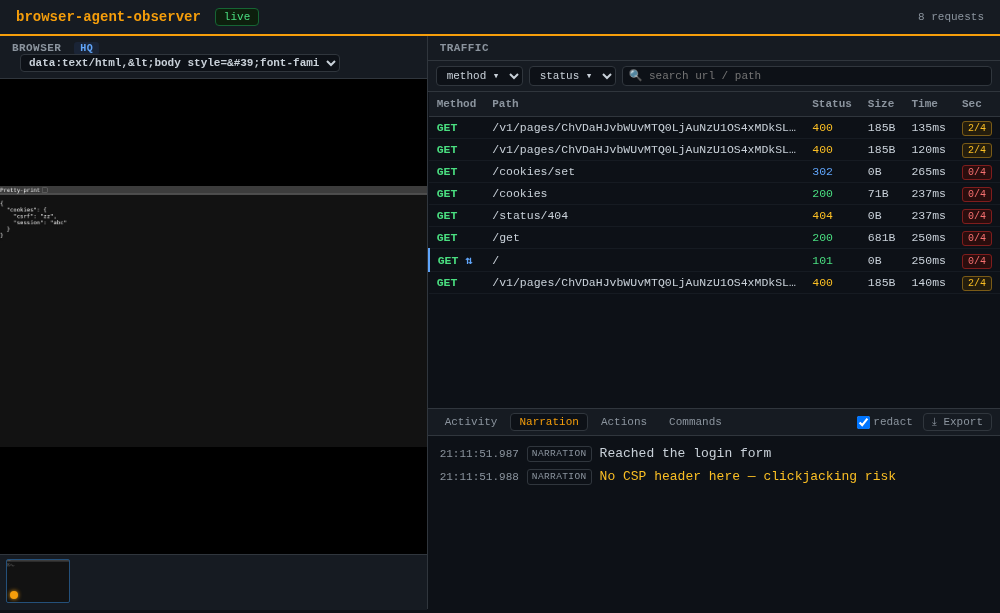
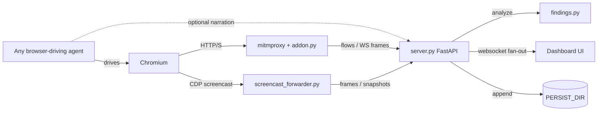

# browser-agent-observer

[](https://github.com/jobpatiphan/browser-agent-observer/actions/workflows/ci.yml)
[](LICENSE)


A live, visual dashboard for watching **any** browser-driving agent — Claude
computer-use, Codex, a Playwright/Puppeteer script, your own harness — do its
thing. Three panes, computer-use style:



- **Browser** — near-real-time screencast of the page (hybrid capture: a light
  motion feed while things move + a crisp high-quality frame once the screen
  settles), with in-page click highlights baked into the pixels and a
  scrubbable filmstrip.
- **Traffic** — every HTTP request/response through a mitmproxy, Burp/ZAP-style:
  filter/search, method/status colors, per-row security-header score, captured
  **WebSocket** frames, and a detail view with Request / Response / Cookies /
  Timing / WebSocket tabs.
- **Activity** — a timeline of narration, actions and commands your agent posts,
  plus auto-detected navigations. One-click **Export** to a self-contained
  replay `.html` (with credential **redaction** and a frame scrubber synced to
  traffic + activity).
- **Findings** — passive security triage of every captured flow: secrets on the
  wire, insecure cookies, missing hardening headers, credentialed CORS
  wildcards, verbose stack traces, reflected input, PII/credit-cards/keys in
  responses, and SQLi/XSS/traversal payloads the agent itself sent — each
  severity-ranked and one click from the request that raised it.

Plus a **◉ Graph** attack-surface map (hosts coloured by worst finding), a
**⟳ Replay** Burp-Repeater-lite, **HAR** export for Burp/ZAP, and a
search-everything box. Multiple tabs? A dropdown picks which to mirror (or
auto-follows). Frame capture tightens automatically during activity.

It's **agent-agnostic**: the dashboard doesn't drive anything. It just observes
a browser you point at it.

**Why not an existing viewer?** Live browser viewers usually ship *inside* one
agent framework (you must drive with their runner), and LLM-observability tools
(Langfuse, Braintrust, AgentOps…) trace prompts and tokens, not the wire. This
sits in the gap: decoupled from any driver, and it pairs the screencast with
**Burp/ZAP-style HTTP+WebSocket inspection** (security-header scoring, redacted
replay export) — built for *watching and auditing* a browser agent, security
work included.

## Quickstart

```bash
git clone https://github.com/jobpatiphan/browser-agent-observer
cd browser-agent-observer

python3 -m venv .venv && . .venv/bin/activate
pip install -r requirements.txt          # fastapi, uvicorn, mitmproxy, httpx…

cp .env.example .env                      # optional — defaults work as-is
./run.sh up                               # starts backend + proxy + forwarder
```

`run.sh up` waits for the backend, then **opens the dashboard in your browser**
automatically (set `OPEN_DASH=0` for headless/CI). Then:

```bash
./run.sh browser        # launches a Chromium wired to the proxy + CDP for you
#   (reuses an already-open CDP session instead of spawning a duplicate)
#   — or launch your agent's own browser with:
#     chromium --remote-debugging-port=9222 --proxy-server=127.0.0.1:8083 \
#              --user-data-dir=/tmp/bao-browser --ignore-certificate-errors
```

Drive the browser with your agent — traffic, frames and navigations show up
live at **http://127.0.0.1:8790** (`./run.sh open` reopens it). `./run.sh down`
stops everything; `./run.sh status` /
`./run.sh logs <backend|proxy|screencast|browser>` to inspect.

### Or with Docker

```bash
docker compose up --build       # backend + proxy + forwarder in containers
#   (on distros whose docker package lacks the compose plugin, use the
#    standalone command instead:  docker-compose up --build)
```

The browser stays on your host; the forwarder reaches its CDP via
`host.docker.internal`. Dashboard at http://localhost:8790. Verified end-to-end:
image builds, all three services orchestrate, and a proxied request lands on the
containerized backend.

## How it connects (the whole contract)

The observer needs just two things from your setup — both configurable:

1. **A browser exposing CDP + routed through the proxy.** Launch it with
   `--remote-debugging-port=9222` (CDP, for the screencast) and
   `--proxy-server=127.0.0.1:8083` (for traffic capture). The forwarder grabs
   whatever page target it finds — no cooperation from your driver required.
2. *(optional)* **Your agent narrating what it does** via the HTTP API or the
   drop-in clients, so the timeline shows intent, not just resulting traffic.

Nothing else is assumed about *how* the browser is driven.

## Telling the dashboard what your agent is doing

Drop-in clients (`clients/`, zero dependencies) — see `clients/README.md`:

```python
from observer import obs
obs.narrate("Trying SQLi on the login form", level="warn")
obs.click("button#login", x=203, y=411)      # cursor + in-page highlight
obs.command("sqlmap -u https://target/login --forms")
```

Or hit the HTTP API directly:

```bash
curl -sX POST localhost:8790/action -H 'content-type: application/json' \
  -d '{"type":"click","target":"button#login","coords":{"x":203,"y":411}}'
```

`navigate` markers appear automatically — the forwarder watches CDP
`Page.frameNavigated` for you.

| Endpoint | Purpose |
|---|---|
| `POST /narrate` | `{text, level}` — info/warn/error line |
| `POST /action` | `{type, target?, coords?}` — click/type/scroll/navigate/key |
| `POST /command` | `{cmd}` — shell command line (monospace) |
| `GET /history` | recent frames (filmstrip lazy-load) |
| `GET /export[?redact=1]` | full session snapshot → self-contained replay `.html`; `redact=1` masks credentials |
| `GET /export.har[?redact=1]` | captured traffic as HAR 1.2 → import into Burp / ZAP / DevTools |
| `GET /findings` | security findings, most-severe first |
| `GET /search?q=` | one search across traffic, WS, narration, commands, findings |
| `GET /graph` | hosts + relationships (Referer/redirect) for the attack-surface map |
| `POST /replay` | `{method,url,headers?,body?}` — resend through the proxy (Repeater) |
| `POST /snapshot` | capture a DOM + frame snapshot now |
| `GET /sessions`, `GET /sessions/{name}` | list / reopen persisted sessions (needs `PERSIST_DIR`) |
| `POST /select-tab` | `{targetId}` — choose which browser tab to mirror (null = auto) |
| `GET /metrics` | Prometheus-style gauges (flows, frames, clients, findings, uptime) |
| `GET /healthz` | liveness + counts |

CLI export (no UI): `./run.sh export [--out file.html] [--no-redact]`.

## Auto-coordinate with Claude Code / Codex

You can make your agent light up the dashboard automatically — see
`integrations/`:

- **Claude Code** (`integrations/claude-code/`): a global hook
  (`hooks/claude_mirror.py`) mirrors every Bash command, prompt and edit onto
  the timeline — the harness runs it, so it happens every time without the model
  remembering. It probes `/healthz` first and **no-ops in ~0.15s when the
  dashboard is down**, so it's safe to install globally. Plus an
  `/observe-agent-browser` skill that starts the dashboard, opens it, and
  switches Claude into narrate mode.
- **Codex** (`integrations/codex/`): `AGENTS.md` + an `obs-run` wrapper (Codex
  has no hooks, so mirroring is opt-in via the wrapper).
- **Any other driver** — Playwright, Puppeteer, Selenium, browser-use, LangGraph:
  copy-paste launch flags in [`integrations/recipes.md`](integrations/recipes.md)
  (runnable Playwright example under `integrations/playwright/`).

## Configuration

All via env (see `.env.example`) — every value has a loopback default:

| Var | Default | Meaning |
|---|---|---|
| `DASH_HOST` / `DASH_PORT` | `127.0.0.1` / `8790` | dashboard bind address |
| `DASH_BACKEND` | `127.0.0.1:8790` | where addon/forwarder reach the backend |
| `PROXY_HOST` / `PROXY_PORT` | `127.0.0.1` / `8083` | traffic proxy listen address |
| `CDP_URL` | `http://localhost:9222` | CDP endpoint of the driven browser |
| `DASH_ALLOWED_ORIGINS` | *(none)* | extra allowed WS Origins, comma-separated |
| `OPEN_DASH` | `1` | `run.sh up` auto-opens the dashboard (`0` = headless/CI) |
| `BROWSER_USER_DATA_DIR` | `/tmp/bao-browser` | dedicated profile for `run.sh browser` |
| `SCOPE_HOSTS` | *(all)* | comma-separated host globs to capture (e.g. `*.target.com,10.0.0.*`) |
| `DASH_TOKEN` | *(none)* | shared-token gate on the API + websockets when binding beyond loopback |
| `PERSIST_DIR` | *(none)* | append each session to JSONL here so it can be reopened |

## Security auditing

Built for watching a browser agent with a pentester's eye:

- **Findings** — every flow is triaged for secrets in URLs, insecure cookies,
  missing hardening headers, credentialed CORS wildcards, verbose stack traces,
  reflected input, PII / credit-cards / API keys / private keys in responses,
  and SQLi / XSS / path-traversal / command-injection payloads the agent sent.
  Heuristic leads to verify by hand — see `findings.py`.
- **◉ Graph** — an attack-surface map: each host the session touched, coloured
  by its worst finding, linked by Referer and redirect edges.
- **⟳ Replay** — open any captured request, edit method/url/headers/body, resend
  through the proxy; it reappears on the timeline and is re-scored.
- **HAR export** — hand the traffic to Burp / ZAP / DevTools.
- **Scope** — set `SCOPE_HOSTS` to keep out-of-scope noise off the timeline.

> Replay sends real traffic and the API can drive requests, so gate it with
> `DASH_TOKEN` whenever the dashboard isn't strictly on loopback.

## Architecture



## HTTPS interception

mitmproxy needs its CA trusted to decrypt HTTPS. Either keep
`--ignore-certificate-errors` on the browser (simplest for headless/testing),
or trust the CA at `~/.mitmproxy/mitmproxy-ca-cert.pem` (Docker writes it to
`./certs/`). See <https://docs.mitmproxy.org/stable/concepts-certificates/>.

## Ports

| Port | Service |
|---|---|
| 8790 | dashboard (UI + websocket + HTTP API) |
| 8083 | mitmproxy traffic capture |
| 9222 | browser CDP (remote debugging) |

## Running as a persistent service (Linux)

`systemd/` holds `--user` unit templates (`browser-agent-observer.target` +
three services) — see `systemd/README.md`. `./run.sh` is the simpler
always-works option; `launcher.sh` is a minimal start/stop fallback.

> Note: `systemd --user` services can be torn down at logout unless lingering is
> enabled — `sudo loginctl enable-linger $USER` (one-time) if you want them to
> survive a full logout/reboot.

## Notes

In-memory only (ring buffers), no auth, no DB — a localhost, single-user
observability tool. Don't expose it to a network you don't trust.
